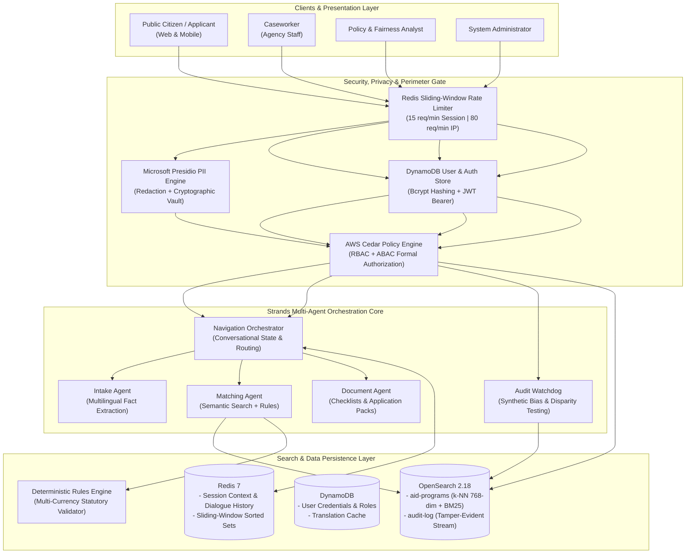
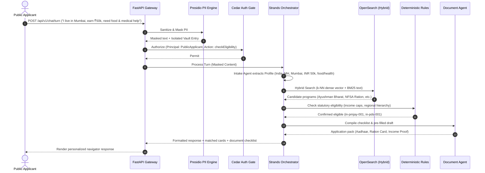

<div align="center">

# 🪽 GreenPhoenix: Global Community Aid Navigator
### *Intelligent, Privacy-First, Multi-Agent Public Assistance Navigation for people in crisis*


<p align="center">
  <strong>Bridging the gap between vulnerable people in crisis and life-saving social safety net programs worldwide.</strong><br>
</p>

</div>

---
A multi-agent AI system that takes a plain-language description of someone's situation, matches it against real, verified eligibility rules for aid programs, and helps them prepare the actual paperwork — with the fairness, privacy, and access-control guarantees that a system touching people's most sensitive financial and personal information has to earn, not assume.


## 📖 Table of Contents

- [Overview & Vision](#-overview--vision)
- [Key Features](#-key-features)
- [Supported Global & Regional Programs](#-supported-global--regional-programs)
- [System Architecture](#-system-architecture)
- [Security, Privacy & Cedar Authorization](#-security-privacy--cedar-authorization)
- [Technology Stack](#-technology-stack)
- [Project Directory Structure](#-project-directory-structure)
- [Prerequisites & Environment Configuration](#-prerequisites--environment-configuration)
- [Local Development Quickstart](#-local-development-quickstart)
- [Production Deployment (Docker Compose)](#-production-deployment-docker-compose)
- [Verification & Automated Test Suite](#-verification--automated-test-suite)
- [REST API Reference](#-rest-api-reference)
- [Cedar Roles & Permissions Matrix](#-cedar-roles--permissions-matrix)
- [Contributing & License](#-contributing--license)

---

## 🌟 Overview & Vision

Worldwide, billions of dollars in critical government and NGO social welfare benefits go unclaimed each year:
- **Bureaucratic Opacity**: Complex statutory eligibility formulas (gross vs. net income ceilings, household size tiers, disability criteria) confuse applicants.
- **Fragmented Portals**: Aid programs are scattered across dozens of municipal, state, national, and non-profit websites.
- **Language & Literacy Barriers**: Application instructions are often only in official government language with dense legalistic jargon.
- **Privacy Fears**: Vulnerable citizens and immigrants fear sharing sensitive identity data online.
- **Caseworker Burnout**: Social workers spend hours manually reviewing paperwork and checking qualification tables.

**GreenPhoenix (Community Aid Navigator)** is an enterprise-grade, multi-agent AI platform that solves this challenge safely:
1. **Listens Empathetically**: Accepts natural language crisis narratives in any language, extracting essential household parameters without trapping users in repetitive clarification loops.
2. **Protects Privacy by Design**: Automatically scrubs names, phone numbers, SSNs, Aadhaar numbers, and addresses via Microsoft Presidio before LLM inference or vector indexing.
3. **Guarantees Zero Hallucinations**: Employs a dual-tier matching engine—combining OpenSearch dense semantic embeddings for candidate discovery with a deterministic statutory rule engine that checks hard income caps, residency, and household constraints.
4. **Streamlines Applications**: Compiles pre-filled application pack drafts and custom document checklists with localized acquisition tips.
5. **Audits Algorithmic Fairness**: Runs an isolated background watchdog that evaluates Disparate Impact Ratios (DIR) across synthetic demographic permutations to ensure protected groups receive equal access.

---

## ⚡ Key Features

### 🤖 Multi-Agent Orchestration (Strands Core)
- **Intake Agent**: Converts unstructured crisis dialogue into a validated `ApplicantProfile`. Handles zero-income / unemployment recognition (`annual_income = 0.0`), multi-currency conversions (₹/INR, Lakhs, $, £, €), and bounds clarification requests to avoid infinite loops.
- **Matching Agent**: Combines OpenSearch hybrid search with strict programmatic eligibility evaluation. Assigns confidence tiers (`confirmed`, `potential`, `disqualified`) with transparent, plain-language reasoning.
- **Document Agent**: Generates tailored verification document checklists (e.g. Aadhaar, Ration Card, State ID, Pay Stubs, Lease Agreement) with actionable tips on how to acquire missing records.
- **Audit Agent (Watchdog)**: Runs out-of-band synthetic demographic simulations across protected classes (race, gender, zip code, language) and measures Disparate Impact Ratios against the 80% four-fifths civil rights rule.
- **Fast 429 Failover Resilience**: Bounded to 2 rapid retry attempts with exponential backoff on LLM rate limits, gracefully falling back to deterministic evaluation in under 2 seconds.

### 🛡️ Enterprise Security & Privacy
- **Real-Time PII Sanitization (Microsoft Presidio)**: Replaces sensitive identifiers with surrogate tokens (`<PERSON_1>`, `<PHONE_NUMBER_1>`) before passing data to models or audit logs. PII is stored in an isolated, cryptographically segregated vault accessible only through explicit, audited caseworker requests.
- **AWS Cedar Policy Authorization**: Formal verification of all system actions using Cedar v3. Enforces fine-grained Attribute-Based Access Control (ABAC) and Role-Based Access Control (RBAC) with organization scoping and explicit `forbid` rules.
- **Dual-Layer Anti-Abuse Rate Limiting**: Redis-backed sliding window rate limiter enforcing 15 turns/min per session and 80 requests/min per client IP network to defend against cookie-dropping attacks.
- **Tamper-Evident Audit Trails**: Every match decision, caseworker PII reveal, and administrative action is logged to OpenSearch with full provenance.

### 🌐 Modern Accessible Frontend
- Built on **React 19**, **Vite**, and **Tailwind CSS v4** with accessible WCAG 2.1 AA compliance.
- 5 Tailored Persona Views:
  1. **Public Citizen Navigator**: Multilingual conversational intake, real-time program matching, and downloadable application drafts.
  2. **Program Catalog**: Direct public search, multi-faceted filtering, and self-service eligibility checking.
  3. **Caseworker Dashboard**: Multi-tenant case dossier management, PII reveal requests, and unredacted application export.
  4. **Fairness & Bias Analytics**: Real-time Disparate Impact Ratio graphs, Equal Opportunity Gap charts, and demographic audit logs.
  5. **Admin Operations**: OpenSearch index management, re-indexing triggers, and manual synthetic audit runs.

---

## 🗺️ Supported Global & Regional Programs

GreenPhoenix is engineered for global scalability while providing deep statutory rules for localized schemes:

| Region | Program Name | Identifier | Primary Assistance | Key Eligibility Rules |
|---|---|---|---|---|
| 🇮🇳 **India** | **Ayushman Bharat (PM-JAY)** | `in-pmjay-001` | Healthcare / Hospitalization | Annual income $\le$ ₹2.5 Lakh, SECC database inclusion, secondary/tertiary care up to ₹5 Lakh/yr |
| 🇮🇳 **India** | **NFSA / PDS Food Ration** | `in-pds-001` | Food & Nutrition | BPL / Priority Household / AAY cardholder, annual income $\le$ ₹1.5 Lakh |
| 🇮🇳 **India** | **PM-KISAN Samman Nidhi** | `in-pmkisan-001` | Rural Income Support | Small/marginal landholding farmer family, direct cash transfer ₹6,000/yr |
| 🇮🇳 **India** | **PMAY Urban (Housing)** | `in-pmay-001` | Housing & Rent Subsidy | EWS/LIG families, annual income $\le$ ₹6.0 Lakh, must not own a pucca house |
| 🇮🇳 **India** | **MGNREGA Rural Employment** | `in-mgnrega-001` | Employment Guarantee | Adult member of rural household willing to do manual unskilled work, 100 days/yr |
| 🇮🇳 **India** | **NSAP Social Pensions** | `in-nsap-001` | Old Age / Disability Pension | BPL household, age $\ge$ 60 or certified severe disability ($\ge$ 80%) |
| 🇮🇳 **India** | **PM SVANidhi Micro-Credit** | `in-svanidhi-001` | Urban Street Vendor Capital | Urban street vendor with Certificate of Vending / LOR, collateral-free working capital |
| 🇺🇸 **USA (NYC)** | **SNAP (Food Stamps)** | `nyc-snap-001` | Food & Groceries | Gross income $\le$ 130% FPL, NYC resident, citizenship/qualified immigrant |
| 🇺🇸 **USA (NYC)** | **DRIE (Disability Rent Exemption)**| `nyc-drie-001` | Rent Freeze Subsidy | Age $\ge$ 18, receiving qualifying disability benefits (SSI/SSDI), rent $>$ 1/3 income |
| 🇺🇸 **USA (NYC)** | **SCRIE (Senior Rent Exemption)** | `nyc-scrie-001` | Senior Rent Freeze | Age $\ge$ 62, household income $\le$ $50,000, rent-regulated apartment |
| 🇺🇸 **USA (NYC)** | **One-Shot Emergency Grant** | `nyc-oneshot-001` | Emergency Rent / Utility Cash | Imminent eviction or utility shutoff, ability to pay future rent |
| 🇺🇸 **USA (NYC)** | **Cash Assistance (CA/TANF)** | `nyc-cash-001` | Temporary Cash Relief | Needy families and individuals meeting low-income NYC thresholds |
| 🇬🇧 **UK** | **Universal Credit (UC)** | `uk-uc-001` | Living Costs & Housing | UK resident, age 18 to State Pension age, capital/savings under £16,000 |
| 🇨🇦 **Canada** | **Canada Child Benefit (CCB)** | `ca-ccb-001` | Child Financial Support | Canadian resident living with child under 18, tax-free monthly payment |

---

## 🏗️ System Architecture

### High-Level Architecture Diagram



### Conversational Request Lifecycle



---

## 🔒 Security, Privacy & Cedar Authorization

GreenPhoenix adheres to a zero-trust model: **agents and clients never interact with raw, uninspected data directly.**

### 1. Microsoft Presidio PII Engine
- **Inbound Redaction**: Intercepts user messages and identifies Named Entities (`PERSON`, `PHONE_NUMBER`, `EMAIL_ADDRESS`, `US_SSN`, `IN_AADHAAR`, `LOCATION`).
- **Surrogate Vaulting**: Entities are swapped with surrogate tokens (`<PERSON_1>`). The real mapping is vaulted in an encrypted, isolated memory store.
- **Caseworker De-identification**: When caseworkers view case dossiers, all PII remains masked by default. An unmasking request (`POST /cases/{id}/reveal-pii`) requires a dedicated Cedar permission and writes an audit event.

### 2. AWS Cedar Formal Policy Rules
Fine-grained authorization is defined declaratively in [`cedar/policies/policies.cedar`]:
- **Agency Tenant Isolation**:
  ```cedar
  permit (
    principal in Role::"Caseworker",
    action in [Action::"draftApplication", Action::"readApplicantRecord", Action::"exportApplication"],
    resource
  ) when {
    resource.orgId == principal.orgId
  };
  ```
- **Absolute PII Isolation Barrier**:
  ```cedar
  forbid (
    principal,
    action == Action::"readPiiVault",
    resource
  ) when {
    principal in Role::"Analyst" || principal is AuditAgent
  };
  ```
- **Human-in-the-Loop Safeguard**:
  ```cedar
  forbid (
    principal in Role::"PublicApplicant",
    action == Action::"draftApplication",
    resource
  ) when {
    resource.requiresHumanReview == true
  };
  ```

### 3. Dual-Layer Sliding-Window Rate Limiter
Prevents automated scrapers and cookie-dropping attacks using Redis sorted sets:
- **Session Window**: 15 requests per 60-second window per `aid_session` cookie.
- **Network Window**: 80 requests per 60-second window per client IP subnet. If a user rotates cookies, the IP window triggers `429 Too Many Requests` with a `Retry-After` header.

---

## 🛠️ Technology Stack

| Domain | Technology | Version | Purpose |
|---|---|---|---|
| **Backend Framework** | Python / FastAPI | 3.12+ / 0.141+ | High-performance asynchronous REST API |
| **Agentic Framework** | Strands Multi-Agent | 1.55+ | Specialized agent definitions, memory, and fast retry strategies |
| **LLM & Embeddings** | Google Gemini / BedRock | 2.5 Flash | Natural language intake, reasoning, and dense embeddings (`gemini-embedding-001`) |
| **Search & Vector DB** | OpenSearch | 2.18.0 | Hybrid search (k-NN dense vectors + BM25 text) with score normalization |
| **Policy Engine** | AWS Cedar Policy | v3.x | Formal declarative authorization, RBAC, ABAC, and explicit forbid overrides |
| **PII Anonymization** | Microsoft Presidio | 2.2.364+ | Real-time PII analyzer, anonymizer, and surrogate token vaulting |
| **Cache & Limiting** | Redis | 7 Alpine | Sliding-window rate limiter and multi-turn session persistence |
| **Identity & Storage** | AWS DynamoDB | Cloud / Local | User accounts, bcrypt password hashing (12 rounds), translation cache |
| **Language Translation** | AWS Translate | 2024+ | Batch translation of program descriptions and eligibility rules |
| **Frontend Framework**| React 19 / TypeScript | 19.2 / 5.x | Modern, component-based single-page web application |
| **Styling & Icons** | Tailwind CSS / Lucide | v4.3 / 1.41 | Responsive, accessible UI with Lucide icons |
| **Build & Bundler** | Vite / Bun | 8.2+ / 1.x | Lightning-fast HMR and production web builds |
| **Containerization** | Docker & Compose | Latest | Local multi-service development and production cloud deployment |
| **Deployment** | AWS EC2 | t3-large | Cloud hosting with Nginx reverse proxy and health checks |

---

## 📁 Project Directory Structure

```text
GreenPhoenix/
├── cedar/
│   └── policies/
│       └── policies.cedar              # AWS Cedar RBAC & ABAC formal authorization policies
├── client/                             # React 19 + TypeScript + Tailwind CSS Frontend
│   ├── src/
│   │   ├── components/                 # Navigation, Modals, Status Badges, Chat Bubbles
│   │   ├── context/                    # Auth, Theme, and Language context providers
│   │   ├── services/                   # API client bindings for FastAPI backend
│   │   ├── types/                      # TypeScript interfaces and data models
│   │   └── views/
│   │       ├── NavigatorView.tsx       # Conversational Citizen Intake & Application Assistant
│   │       ├── ProgramCatalogView.tsx  # Searchable, filterable aid programs directory
│   │       ├── CaseworkerView.tsx      # Case dossier management & PII reveal workflow
│   │       ├── AnalystView.tsx         # Fairness & Disparate Impact Ratio (DIR) charts
│   │       ├── AdminView.tsx           # Index management and manual audit executions
│   │       ├── AuthView.tsx            # Persona-based login & registration
│   │       └── HomeView.tsx            # Landing page and platform introduction
│   ├── Dockerfile                      # Production Nginx multi-stage build
│   ├── package.json                    # Bun / NPM dependencies
│   └── vite.config.ts                  # Vite build configuration
├── data/
│   ├── aid_programs_populated.csv      # Global & regional programs dataset (India, US, UK, Canada)
│   ├── audit_scenarios.json            # Synthetic demographic personas for fairness evaluation
│   └── seed_opensearch.py              # Index creation & vector embedding seed script
├── plans/                              # System architecture documents and roadmap
├── server/                             # Python 3.12 FastAPI + Strands Backend
│   ├── src/
│   │   └── server/
│   │       ├── agents/                 # Strands Multi-Agent Core
│   │       │   ├── orchestrator.py     # Central Navigator Orchestrator
│   │       │   ├── intake_agent.py     # Multilingual fact extraction & profile builder
│   │       │   ├── matching_agent.py   # Hybrid vector search + deterministic match coordinator
│   │       │   ├── document_agent.py   # Application pack & document checklist generator
│   │       │   └── audit_agent.py      # Synthetic disparity watchdog & DIR calculation
│   │       ├── core/                   # Core platform services
│   │       │   ├── auth.py             # Cedar policy evaluation & JWT auth
│   │       │   ├── llm.py              # Gemini model bindings & fast 429 retry strategy
│   │       │   ├── presidio_sanitizer.py # Presidio PII redaction and vaulting
│   │       │   ├── rate_limit.py       # Redis dual-layer sliding-window limiter
│   │       │   ├── region_hierarchy.py # Global administrative & municipal location resolver
│   │       │   ├── rules_parser.py     # Multi-currency statutory eligibility parser
│   │       │   ├── user_store.py       # DynamoDB user repository with local fallback
│   │       │   └── translation.py      # AWS Translate batch engine & cache
│   │       ├── routers/                # FastAPI endpoint controllers (chat, auth, caseworker, etc.)
│   │       ├── tools/                  # OpenSearch search & eligibility tools
│   │       └── tests/                  # Integration test suite (clarification, cedar, rate limits)
│   ├── Dockerfile                      # Production backend container definition
│   ├── pyproject.toml                  # Python 3.12 project metadata & UV dependencies
│   └── .env.example                    # Environment configuration template
├── docker-compose.yml                  # Local development services (OpenSearch, Redis, DynamoDB)
├── docker-compose.prod.yml             # Full-stack production deployment configuration
├── SYSTEM_SUMMARY.md                   # Comprehensive technical specification & challenge log
└── README.md                           # This document
```

---

## ⚙️ Prerequisites & Environment Configuration

### Prerequisites
- **Docker & Docker Compose** (v24+)
- **Python 3.12+** with [uv](https://docs.astral.sh/uv/) installed
- **Node.js 20+** or [Bun](https://bun.sh/)
- **Google Gemini API Key** (from [Google AI Studio](https://aistudio.google.com/))

### Environment Configuration
Copy the template in `server/.env.example` to `server/.env`:
```bash
cp server/.env.example server/.env
```

Edit `server/.env` with your credentials:
```ini
# OpenSearch Configuration
OPENSEARCH_HOST=http://localhost:9200

# LLM & Embedding Configuration
MODEL_PROVIDER=gemini
GEMINI_API_KEY=your_gemini_api_key_here
PRIMARY_LLM_MODEL=gemini-2.5-flash
EMBEDDING_MODEL=gemini-embedding-001

# Storage & Policies
DATABASE_URL=sqlite:///./local_state.db
CEDAR_POLICIES_PATH=cedar/policies
CSV_AID_PROGRAMS_PATH=data/aid_programs_populated.csv
AUDIT_SCENARIOS_PATH=data/audit_scenarios.json

# Redis
REDIS_URL=redis://localhost:6379/0

# Security & Authentication
SECRET_KEY=generate_a_random_32_character_secret_key_here
COOKIE_SECURE=false

# DynamoDB (leave endpoint empty to use AWS Cloud DynamoDB)
DYNAMODB_ENDPOINT_URL=http://localhost:8001
DYNAMODB_TABLE_USERS=greenphoenix-users
DYNAMODB_TABLE_TRANSLATIONS=greenphoenix-translations
DYNAMODB_REGION=us-east-1

# Optional AWS Credentials (for AWS Translate / Cloud DynamoDB)
AWS_ACCESS_KEY_ID=your_aws_access_key
AWS_SECRET_ACCESS_KEY=your_aws_secret_key
AWS_DEFAULT_REGION=us-east-1
```

---

## 🚀 Local Development Quickstart

### Step 1: Start Infrastructure Containers
Launch OpenSearch, OpenSearch Dashboards, Redis, and DynamoDB Local:
```bash
docker compose up -d
```
Verify all containers are healthy:
```bash
docker compose ps
```
- OpenSearch: `http://localhost:9200`
- OpenSearch Dashboards: `http://localhost:5601`
- DynamoDB Local: `http://localhost:8001`
- Redis: `localhost:6379`

### Step 2: Seed OpenSearch with Aid Programs & Embeddings
Run the seed script using `uv` to create indices and generate dense vector embeddings for all programs:
```bash
cd server
uv run python -m server.data.seed
```
*Expected output: `Successfully indexed 21 programs! Failed: 0`*

### Step 3: Start the FastAPI Backend
Launch the server with live reload:
```bash
cd server
uv run uvicorn server.main:app --host 0.0.0.0 --port 8000 --reload
```
API Documentation will be available at `http://localhost:8000/docs`.

### Step 4: Start the React Frontend
In a new terminal, install dependencies and launch the client:
```bash
cd client
bun install   # or: npm install
bun dev       # or: npm run dev
```
Open your browser at `http://localhost:5173`.

---

## 🚢 Production Deployment (Docker Compose)

GreenPhoenix includes a battle-tested `docker-compose.prod.yml` ready for deployment on AWS EC2, DigitalOcean, or private cloud VMs.

```bash
# Build and run all services in production mode
docker compose -f docker-compose.prod.yml up --build -d
```

### Production Architecture Features:
- **Nginx Reverse Proxy**: Pre-configured SPA routing and proxy passes for `/api/v1` and `/health`.
- **Health Checks**: Automated container restart policies and dependency wait checks.
- **Direct AWS Cloud Integration**: Automatic failover to native AWS DynamoDB and AWS Translate when cloud credentials are provided.

---

## 🧪 Verification & Automated Test Suite

GreenPhoenix includes a comprehensive automated test suite verifying orchestration resilience, Cedar policies, PII vaulting, and sliding-window rate limits.

Run tests using `uv`:

```bash
cd server

# 1. Test multi-turn clarification loops, fast 429 retries, and Indian scheme matching
uv run python src/server/tests/test_clarification_loop.py

# 2. Test AWS Cedar authorization policies (RBAC, ABAC, and forbid rules)
uv run python src/server/tests/test_cedar_auth.py

# 3. Test Redis dual-layer sliding-window rate limiting
uv run python src/server/tests/test_rate_limit.py

# 4. Test OpenSearch hybrid search & normalization pipeline
uv run python src/server/tests/test_opensearch.py
```

### Sample Verification Output:
```text
========================================================
ALL 4 CLARIFICATION & MATCHING TESTS PASSED PERFECTLY!
========================================================
✓ Turn 1: Extracted location and income without looping
✓ Turn 2: Dispatched matching with OpenSearch k-NN
✓ Turn 3: Generated application pack and document checklist
✓ Turn 4: Informational questions answered without re-triggering intake
✓ 429 Throttling: Instantaneous (<2s) fallback to deterministic engine
```

---

## 📡 REST API Reference

All endpoints are prefixed with `/api/v1` (except `/health`).

### Authentication (`/api/v1/auth`)
| Method | Endpoint | Access | Description |
|---|---|---|---|
| `POST` | `/api/v1/auth/register` | Public | Register a persona (`Caseworker`, `Analyst`, `Admin`). Caseworkers must supply `org_id`. |
| `POST` | `/api/v1/auth/login` | Public | Authenticate with email & password to receive signed JWT Bearer token. |
| `GET` | `/api/v1/auth/me` | Authenticated | Retrieve profile, role, and organization attributes of current user. |

### Conversational Navigator (`/api/v1/chat`)
| Method | Endpoint | Access | Description |
|---|---|---|---|
| `POST` | `/api/v1/chat/turn` | Session Cookie | Process conversational intake turn, extract profile, and run hybrid matching. |
| `GET` | `/api/v1/chat/session` | Session Cookie | Retrieve current conversational session state and extracted profile. |
| `DELETE` | `/api/v1/chat/session` | Session Cookie | Clear conversational history and reset session state. |

### Aid Programs Catalog (`/api/v1/programs`)
| Method | Endpoint | Access | Description |
|---|---|---|---|
| `GET` | `/api/v1/programs/search` | Public | Hybrid vector + keyword search across global aid programs. |
| `GET` | `/api/v1/programs/{id}` | Public | Retrieve comprehensive program details, rules, and document requirements. |
| `POST` | `/api/v1/programs/{id}/check-eligibility` | Public | Run deterministic statutory rules engine against submitted parameters. |

### Caseworker Case Management (`/api/v1/caseworker`)
| Method | Endpoint | Access | Description |
|---|---|---|---|
| `GET` | `/api/v1/caseworker/cases` | Caseworker JWT | List active case dossiers scoped to worker's organization (`org_id`). |
| `POST` | `/api/v1/caseworker/cases` | Caseworker JWT | Ingest new case with automated PII masking. |
| `GET` | `/api/v1/caseworker/cases/{id}` | Caseworker JWT | View masked case details (cross-org access blocked by Cedar). |
| `POST` | `/api/v1/caseworker/cases/{id}/reveal-pii`| Caseworker JWT | Reveal real identity entities and write audit log event. |
| `GET` | `/api/v1/caseworker/cases/{id}/export` | Caseworker JWT | Export full application packet. |

### Fairness & Audit Watchdog (`/api/v1/audit`)
| Method | Endpoint | Access | Description |
|---|---|---|---|
| `GET` | `/api/v1/audit/metrics` | Analyst / Admin | Retrieve aggregated Disparate Impact Ratios (DIR) and parity charts. |
| `POST` | `/api/v1/audit/run` | Admin JWT | Trigger synthetic demographic bias simulation run. |
| `GET` | `/api/v1/audit/reports/{id}` | Analyst / Admin | Fetch specific audit report with all PII and profiles stripped. |

---

## 🛡️ Cedar Roles & Permissions Matrix

The Cedar policy engine evaluates requests against principles of **least privilege**, **tenant scoping**, and **absolute forbid overrides**:

| Role | Permitted Actions | Conditions & Scope | Explicit Forbids |
|---|---|---|---|
| **`PublicApplicant`** | `searchPrograms`<br>`checkEligibility`<br>`getProgramRequirements`<br>`readOwnSession`<br>`deleteOwnSession`<br>`draftApplication` | Scoped to own session:<br>`resource.sessionOwnerId == principal.id` | Cannot draft high-stakes programs where `resource.requiresHumanReview == true`.<br>Cannot access caseworker cases or audit metrics. |
| **`Caseworker`** | `searchPrograms`<br>`checkEligibility`<br>`draftApplication`<br>`readApplicantRecord`<br>`exportApplication`<br>`readPiiVault` | Strictly scoped to agency organization:<br>`when { resource.orgId == principal.orgId }` | Accessing records of any other agency (`orgId` mismatch).<br>Triggering system audits or re-indexing. |
| **`Analyst`** | `readAuditMetrics`<br>`searchPrograms` | Aggregate statistics only:<br>`unless { resource.containsPII == true }` | **Explicit Forbid**: `readPiiVault`<br>**Explicit Forbid**: `readApplicantRecord`<br>Cannot view individual client dossiers. |
| **`Admin`** | `runAuditManually`<br>`manageIndices`<br>`readApplicantRecord` | Global operational scope | Bounded by least privilege. Cannot view PII vault without explicit elevation. |
| **`AuditAgent`** | `replaySyntheticProfiles` | Service principal: `AuditAgent::"bias-auditor"` | **Explicit Forbid**: `readPiiVault` |

---

## 🤝 Contributing & License

Contributions are welcome! Please follow these guidelines:
1. Fork the repository and create your feature branch: `git checkout -b feature/my-new-feature`.
2. Commit your changes with clear, descriptive commit messages.
3. Verify that all tests pass (`uv run python src/server/tests/test_clarification_loop.py`).
4. Submit a Pull Request.

### License
This project is licensed under the **MIT License**. See the [LICENSE](LICENSE) file for details.

---

<div align="center">
  <sub>For those who are in crisis and need across the globe.</sub>
</div>
